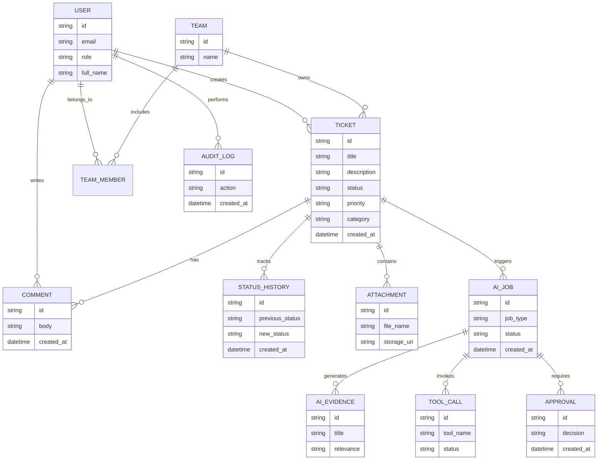

# Domain Model and Database Design

## Overview

This document captures the core Solvix domain model and the database structure that supports the ticket workflow and AI assistance layer.

## Core entities

## Major tables

- users
- teams
- team_members
- tickets
- ticket_status_history
- comments
- attachments
- ai_jobs
- ai_job_evidence
- ai_job_tool_calls
- approval_decisions
- audit_logs
- knowledge_items

## Design principles

- Ticket is the source of truth.
- AI artifacts are linked but not authoritative.
- Status and assignment history must be retained.
- Audit log should capture meaningful changes.
- The schema should support search, filtering, and operational dashboards.

## Summary

The database is designed to support workflow processing, traceability, and AI-assisted operational decision-making without allowing AI to directly mutate protected state without validation and approval.
