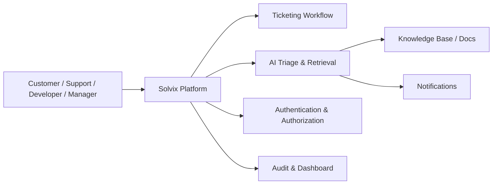
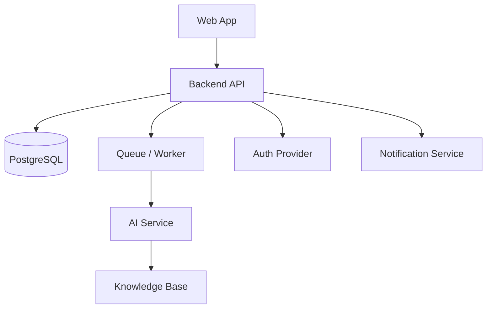

# Solvix System Architecture

This document is the architecture baseline for the Solvix project.

## Overview

Solvix is a workflow platform for issue intake, triage, assignment, investigation, resolution, and auditability. AI is integrated as a controlled support subsystem for classification, retrieval, summarization, and workflow assistance.

## Architectural goals

- centralize issue management in one workflow
- maintain clear human accountability
- provide evidence-based investigation
- keep AI actions bounded and reviewable
- support audit and operational visibility
- allow incremental delivery without premature microservice complexity

## Context diagram

## Container view

## Core architectural principles

1. Product first, AI second.
2. Human approval for protected actions.
3. Backend remains the source of truth for state changes.
4. AI is traceable and observable.
5. Ticket lifecycle and audit trail are critical domain responsibilities.

## Major modules

- Authentication and authorization
- Ticket lifecycle management
- Team and assignment management
- Comments and collaboration
- Dashboard and reporting
- AI triage and evidence retrieval
- Audit logging and telemetry

## Initial deployment model

- Web frontend
- Backend API
- PostgreSQL database
- Queue or background worker
- AI service for classification and retrieval
- optional knowledge store or document index

## Summary

The architecture is intentionally conservative: a modular, operationally simple foundation that supports AI assistance without allowing uncontrolled automation.
